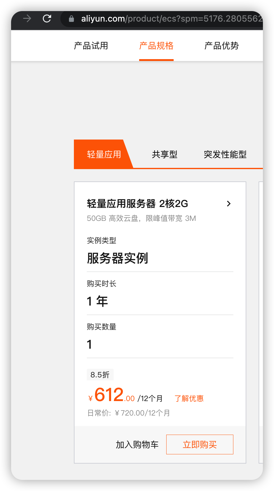
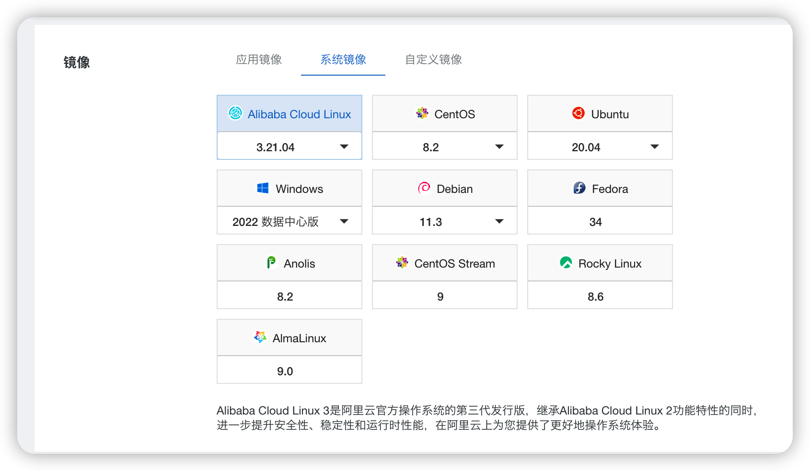
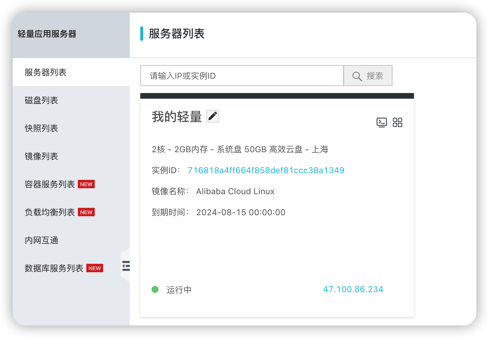
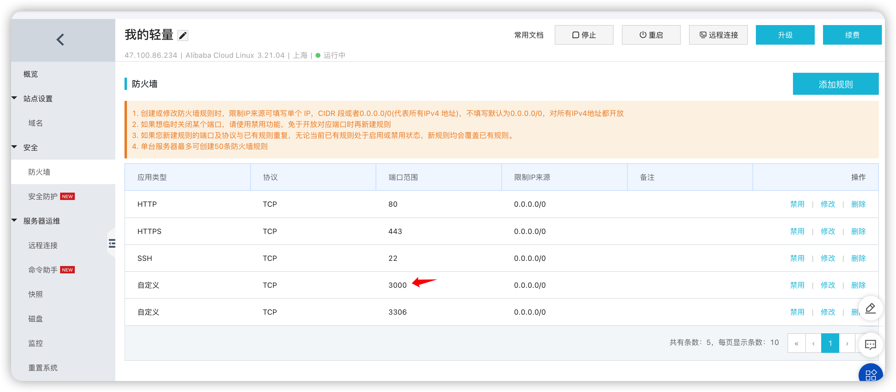
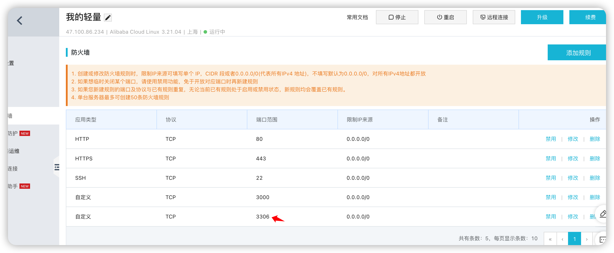
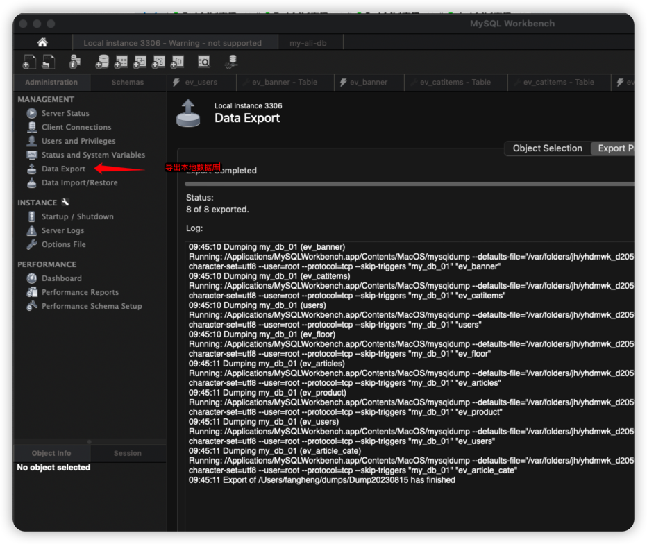
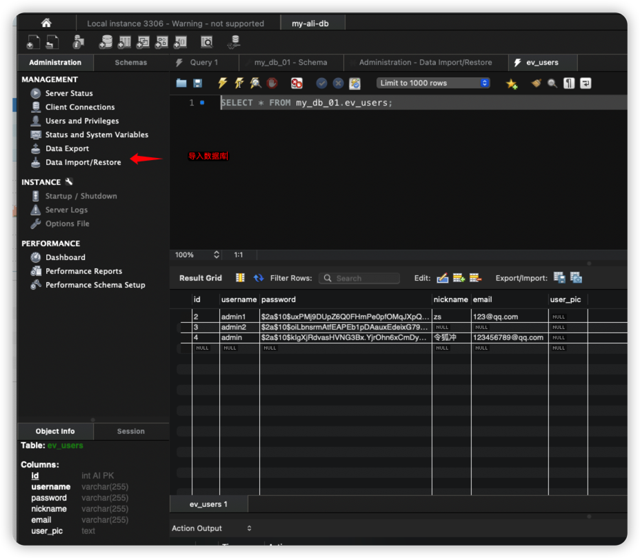
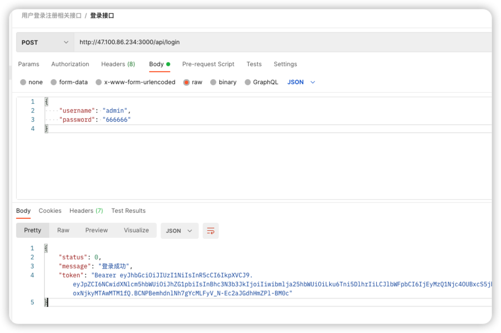
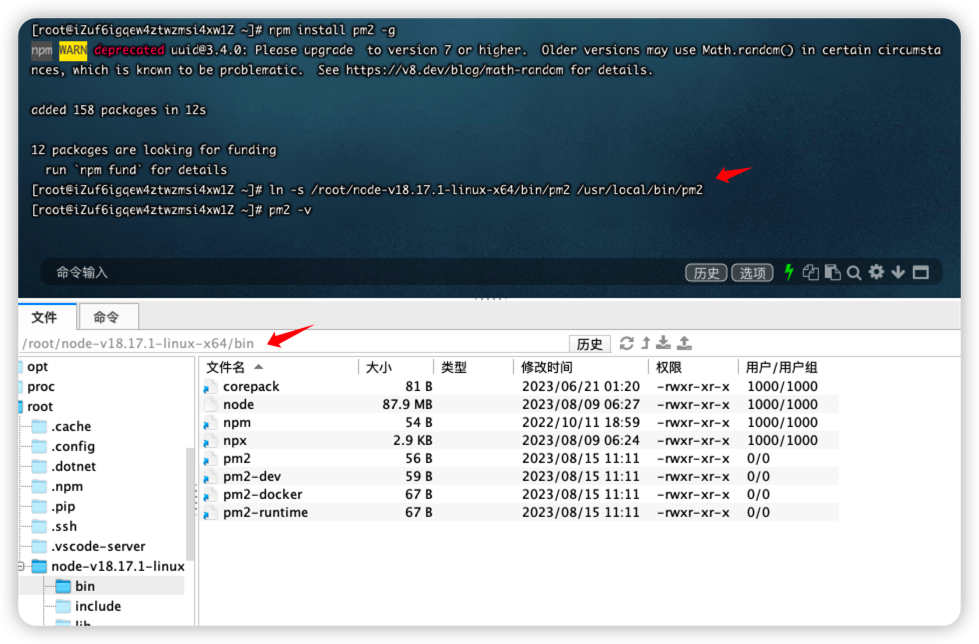
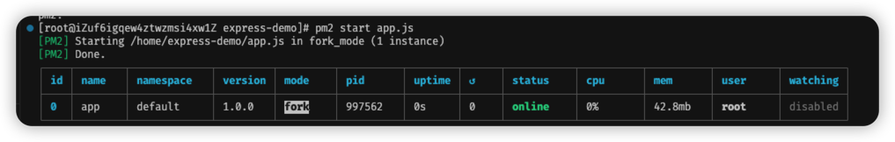

> 背景: 使用 nodejs+express+mysql 在本地写的接口和数据库,只能本地调试访问, 如果想要外网访问, 需要部署到远程服务器上, 于是在阿里云平台花了 108 买了一年的轻量应用服务器. 没有部署过, 为了达到这个目标: nodejs+express 项目在服务器上部署运行, 连接服务器里的数据库, 在远程可以正常调用接口. 自己摸索着部署了一下.

## 在阿里云平台购买轻量应用服务器

<!-- more -->

1. 进入[阿里云平台](https://www.aliyun.com/?spm=5176.10173289.top-nav.dlogo.11322e770VC5ge)
2. 登录账号, 账号需要实名认证
3. 购买的产品 
4. 购买配置, 用的是系统镜像(Alibaba Clound Linux)
5. 购买完成后在轻量应用管理可以看到

## 连接远程服务器并部署项目环境

### 使用 FinalShell 连接

### 安装 node 环境

```sh
// 1. 下载最新稳定版的node包
wget https://nodejs.org/dist/v18.17.1/node-v18.17.1-linux-x64.tar.xz
// 2. 解压
tar xvf node-v18.17.1-linux-x64.tar.xz
// 3. 建立软连接
ln -s /root/node-v18.17.1-linux-x64/bin/node /usr/local/bin/node
ln -s /root/node-v18.17.1-linux-x64/bin/npm /usr/local/bin/npm
// 4. 查看是否安装成功
node -v
npm -v
```

### 上传本地项目到服务器

1. 把本地的 `nodejs-express` 项目压缩文件成 zip 包
2. 使用 `finalShell` 把压缩后的文件传到服务器上, 我放的是/home/文件夹下

### 安装 zip/unzip

```sh
// 查看是否安装了zip/unzip
yum list | grep zip/unzip
yum install zip
yum install unzip
```

### 解压文件

```sh
unzip express-demo.zip
```

### 试运行 express 项目

```sh
// 1.进入项目
cd express-demo/
// 2.运行项目
node app.js
// 可以正常跑起来即运行成功
```

### 在阿里云轻量应用管理平台添加防火墙端口

使用 postman 调用接口时, 发现访问不通, 原因是防火墙的端口没开, 需要开防火墙端口, 项目接口使用的 3000 端口:

再使用 postman 调用接口, 发现可以调通了, 但是报连接数据库的错误, 因为之前本地的项目是使用的本地数据库, 服务器上暂时没有数据库, 所以接下来需要在服务器上创建数据库.

## 在服务器端添加数据库

### 安装 MySql

```sh
// 1. 安装mysql
yum install mysql-server
// 2. 启动mysql
service mysqld start
```

### 登录 MySql

默认是没有设置密码的

```sh
mysql -u root -p
```

设置 root 用户

```sh
// 1. 使用mysql表
use mysql;
// 2. 查询用户信息
select User, Host from user;
// 3. 修改用户信息
update user set Host='%' where User='root' and Host='localhost' limit 1;
// 4. 应用
flush privileges;
// 5. 再次查看是否修改成功
select User, Host from user;
```

设置 root 用户密码

```sh
alter user 'root'@'%' identified by <password>;
```

### 防火墙打开数据库端口

数据库默认是 3306 端口, 在阿里云管理平台打开防火墙端口

### 验证是否可以访问远程数据库

打开 iterm

```sh
mysql -h <ip> -P 3306 -u root <password>
```

### 修改服务器端项目里连接数据库的密码

使用 VSCode 的资源管理器插件连接远程服务器, 并打开项目文件, 修改项目中连接数据库的密码.

## 使用 workbench 把本地的数据库迁移到服务器上

### 导出本地数据库

data export: 

### 连接远程数据库

连接远程数据库后, 在远程数据库里导入数据
data import: 

### 使用 postman 测试接口是否正常

测试接口:

## 自动启动项目 pm2

当我退出 shell 远程服务器时, 项目会自动停止了, 需要安装状态代理包 pm2.

1. 全局安装

   ```sh
   npm install -g pm2
   ```

   全局包是安装在 node 目录里的.

2. 建立软链接

   ```sh
   ln -s /root/node-v18.17.1-linux-x64/bin/pm2 /usr/local/bin/pm2
   ```

   

3. 进入 express 项目,使用 pm2 启动项目

   ```sh
   pm2 start app.js
   ```

   
