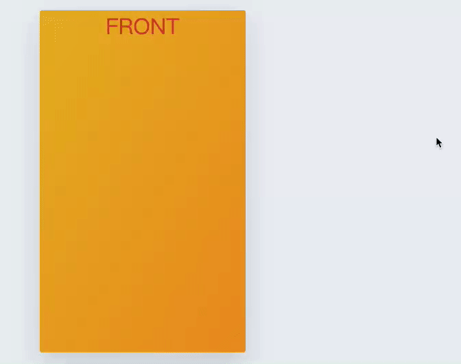

使用 `CSS` 实现翻牌效果, 结果图:


<!-- more -->

代码如下:
`html` 代码:

```html
<div class="card">
  <div class="card__item card__item--front">
    <h2 class="card__item--front--heading">Front</h2>
  </div>
  <div class="card__item card__item--back">
    <h2 class="card__item--back--heading">Back</h2>
  </div>
</div>
```

`less` 样式代码:

```less
.card {
  position: relative;
  width: 300px;
  height: 500px;
  perspective: 1500px;

  &__item {
    position: absolute;
    top: 0;
    left: 0;
    width: 100%;
    height: 100%;
    overflow: hidden;
    border-radius: 3px;
    box-shadow: 0 15px 40px rgba(0, 0, 0, 0.15);
    backface-visibility: hidden;
    cursor: pointer;
    transition: all 0.8s ease;

    &--front {
      background-image: linear-gradient(to right bottom, #e9b824, #ee9322);

      &--heading {
        color: #d83f31;
      }
    }

    &--back {
      background-image: linear-gradient(to right bottom, #78d6c6, #419197);
      transform: rotateY(180deg);

      &--heading {
        color: #f5fccd;
      }
    }

    h2 {
      font-size: 30px;
      font-weight: 300;
      text-align: center;
      text-transform: uppercase;
    }
  }

  &:hover .card__item--front {
    transform: rotateY(-180deg);
  }

  &:hover .card__item--back {
    transform: rotateY(0);
  }
}
```

主要属性说明:

- `perspective`: 指定观察者与 z=0 平面的距离,使具有三维位置变换的元素产生透视效果.
- `backface-visibility`: 指定当元素背面朝向观察者时是否可见.
- `rotateY`: 让一个元素围绕纵坐标(垂直轴)旋转, 而不会对其进行变形.
