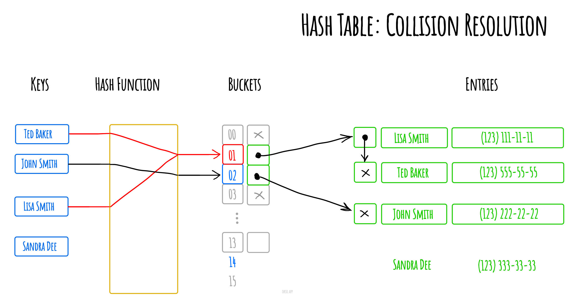

## 哈希表

在计算中, 一个 **哈希表(hash table 或 hash map)** 是一种实现 _关联数组(associative array)_
的抽象数据类型, 该结构可以将 _键映射到值_。

哈希表使用 _哈希函数/散列函数_ 来计算一个值在数组或桶(buckets)中或槽(slots)中对应的索引,可使用该索引找到所需的值。

理想情况下,散列函数将为每个键分配给一个唯一的桶(bucket),但是大多数哈希表设计采用不完美的散列函数,这可能会导致"哈希冲突(hash collisions)",也就是散列函数为多个键(key)生成了相同的索引,这种碰撞必须
以某种方式进行处理。

<!-- more -->


通过单独的链接解决哈希冲突



### 构造函数 constructor

```javascript
/**
 * @param {number} hashTableSize 哈希表大小
 */
constructor(hashTableSize = defaultHashTableSize) {
  // 创建指定大小的哈希表，并将每个桶填充为空的链表
  this.buckets = Array(hashTableSize).fill(null).map(() => new LinkedList());

  // 用于快速追踪哈希表中的所有实际键
  this.keys = {};
}
```

### hash(key) 方法

```javascript
/**
 * 将键字符串转换为哈希数。
 *
 * @param {string} key 键字符串
 * @return {number} 哈希数
 */
hash(key) {
  // 为了简单起见，我们将使用键字符串中所有字符的字符编码之和来计算哈希。
  //
  // 但是你也可以使用更复杂的方法，比如多项式字符串哈希，以减少冲突的数量：
  //
  // hash = charCodeAt(0) * PRIME^(n-1) + charCodeAt(1) * PRIME^(n-2) + ... + charCodeAt(n-1)
  //
  // 其中 charCodeAt(i) 是键字符串的第i个字符的字符编码，n 是键字符串的长度，PRIME 是任何一个素数，比如 31。
  const hash = Array.from(key).reduce(
    // 使用 reduce 函数来计算字符编码的累加和
    (hashAccumulator, keySymbol) => (hashAccumulator + keySymbol.charCodeAt(0)),
    0,
  );

  // 将哈希数缩小到哈希表的大小范围内。
  return hash % this.buckets.length;
}
```

用于将给定的键字符串转换为哈希数.
通过对键字符串中所有字符的字符编码进行累加，得到哈希数。然后使用取模运算符将哈希数缩小到哈希表的大小范围内。

### set(key, value) 方法

```javascript
/**
 * @param {string} key
 * @param {*} value
 */
set(key, value) {
  // 将输入的键计算出哈希值
  const keyHash = this.hash(key);
  // 将键和对应的哈希值存储到键值对中
  this.keys[key] = keyHash;
  // 找到哈希值对应的桶
  const bucketLinkedList = this.buckets[keyHash];
  // 在桶中查找是否存在相同的键
  const node = bucketLinkedList.find({ callback: (nodeValue) => nodeValue.key === key });

  if (!node) {
    // 如果不存在相同的键，则在桶中添加新的节点
    bucketLinkedList.append({ key, value });
  } else {
    // 如果存在相同的键，则更新已存在节点的值
    node.value.value = value;
  }
}
```

这个方法的作用是向哈希表中添加或更新键值对。它接受一个键和一个值作为参数，并根据键的哈希值找到对应的桶。然后，它检查桶中是否已经存在相同的键。如果存在相同的键，则更新已存在节点的值为新的值。如果不存在相同的键，则在桶的末尾添加一个新的节点，该节点包含新的键和值。这样，通过调用 `set` 方法，可以将键值对添加到哈希表中，或者更新已存在键的值。

### delete(key) 方法

```javascript
/**
 * @param {string} key
 * @return {*}
 */
delete(key) {
  // 计算 key 的哈希值
  const keyHash = this.hash(key);
  // 从 keys 对象中删除指定的 key
  delete this.keys[key];
  // 获取对应哈希值的链表
  const bucketLinkedList = this.buckets[keyHash];
  // 在链表中查找具有相同 key 的节点
  const node = bucketLinkedList.find({ callback: (nodeValue) => nodeValue.key === key });

  // 如果找到了节点
  if (node) {
    // 从链表中删除该节点
    return bucketLinkedList.delete(node.value);
  }

  // 如果没有找到节点，则返回 null
  return null;
}
```

作用是从哈希表中删除指定的键值对。它接收一个键值作为参数，并根据键值的哈希值在哈希表中找到相应的链表。然后，它在链表中查找具有相同键值的节点，并将其从链表中删除。最后，它返回被删除的节点，如果没有找到匹配的节点，则返回 `null`。

### get(key) 方法

```javascript
/**
 * @param {string} key
 * @return {*}
 */
get(key) {
  // 根据 key 的哈希值找到对应的桶（链表）
  const bucketLinkedList = this.buckets[this.hash(key)];
  // 在桶（链表）中查找具有相同 key 的节点
  const node = bucketLinkedList.find({ callback: (nodeValue) => nodeValue.key === key });

  // 如果找到了节点，则返回节点的值；否则返回 undefined
  return node ? node.value.value : undefined;
}
```

这个方法的作用是从哈希表中获取与给定键相关联的值。它通过计算键的哈希值，找到对应的桶（链表），然后在桶中查找具有相同键的节点。如果找到了节点，则返回节点的值；否则返回 `undefined`。简而言之，这个方法实现了哈希表的查询功能。

### has(key) 方法

```javascript
/**
 * @param {string} key
 * @return {boolean}
 */
has(key) {
  // 使用 Object 的 hasOwnProperty 方法来检查 key 是否存在于 this.keys 中
  return Object.hasOwnProperty.call(this.keys, key);
}
```

这个方法的作用是检查给定的 `key` 是否存在于当前对象的 `keys` 属性中。它返回一个布尔值，如果 `key` 存在，则返回 `true`，否则返回 `false`。这个方法可以帮助我们判断一个特定的键是否存在于对象中。

### getKeys() 方法

```javascript
/**
 * @return {string[]}
 */
getKeys() {
  // 使用 Object.keys() 方法提取 this.keys 对象的所有键，并将它们作为一个数组返回
  return Object.keys(this.keys);
}
```

这个方法的作用是获取 `this.keys` 对象的所有键，并以字符串数组的形式返回这些键。它可以帮助你在需要获取对象键的时候，快速地获取到这些键的列表。

### getValues() 方法

```javascript
/**
 * 获取哈希表中存储的所有值的列表。
 *
 * @return {*[]}
 */
getValues() {
  return this.buckets.reduce((values, bucket) => {
    // 将每个桶中的链表节点转换为对应的值，并添加到数组中
    const bucketValues = bucket.toArray()
      .map((linkedListNode) => linkedListNode.value.value);
    // 将所有的值合并到一个数组中
    return values.concat(bucketValues);
  }, []);
}
```

这个方法的作用是获取哈希表中存储的所有值的列表。它通过遍历哈希表中的每个桶，并将每个桶中的链表节点转换为对应的值，然后将所有的值添加到一个数组中，并返回该数组。这样，我们就可以轻松地获取哈希表中所有存储的值。

---

- 源码地址: [JavaScript Algorithms and Data Structures](https://github.com/trekhleb/javascript-algorithms/blob/master/src/data-structures/hash-table/HashTable.js)
