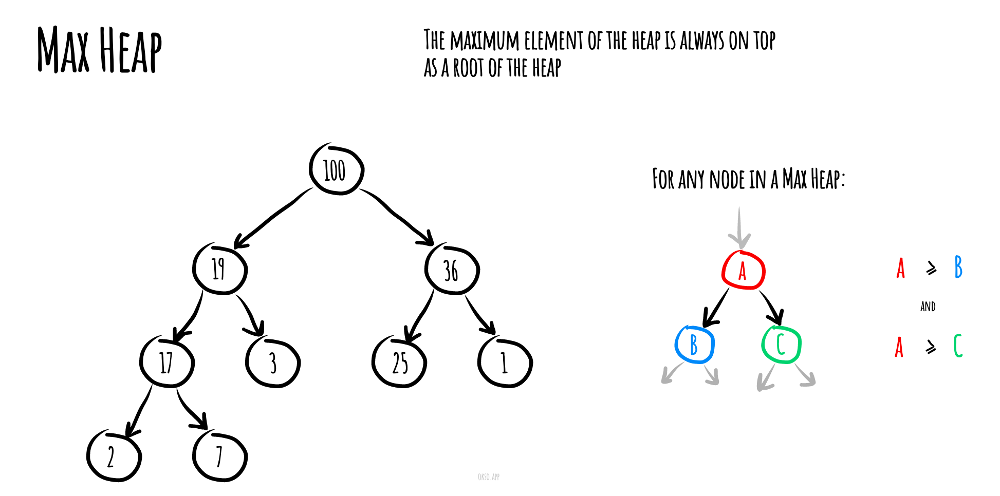

## 堆 (数据结构)

在计算机科学中, 一个 **堆(heap)** 是一种特殊的基于树的数据结构，它满足下面描述的堆属性。

在一个 _最小堆(min heap)_ 中, 如果 `P` 是 `C` 的一个父级节点, 那么 `P` 的 key(或 value)应小于或等于 `C` 的对应值.

<!-- more -->


在一个 _最大堆(max heap)_ 中, `P` 的 key(或 value)大于 `C` 的对应值。




在堆“顶部”的没有父级节点的节点,被称之为根节点。

## Heap 类

### 构造函数 constructor

```javascript
/**
 * @constructs Heap
 * @param {Function} [comparatorFunction] - 可选参数，用于比较元素的函数
 */
constructor(comparatorFunction) {
  // 如果直接构造 Heap 的实例，则抛出错误
  if (new.target === Heap) {
    throw new TypeError('Cannot construct Heap instance directly');
  }

  // 用于存储堆的数组表示
  this.heapContainer = [];

  // 使用传入的 comparatorFunction 创建一个 Comparator 对象
  this.compare = new Comparator(comparatorFunction);
}
```

### getLeftChildIndex(parentIndex) 方法

```javascript
/**
 * @param {number} parentIndex 父节点的索引
 * @return {number} 左子节点的索引
 */
getLeftChildIndex(parentIndex) {
  return (2 * parentIndex) + 1;
}
```

### getRightChildIndex(parentIndex) 方法

```javascript
/**
 * @param {number} parentIndex 父节点的索引
 * @return {number} 右子节点的索引
 */
getRightChildIndex(parentIndex) {
  return (2 * parentIndex) + 2;
}
```

### getParentIndex(childIndex) 方法

```javascript
/**
 * @param {number} childIndex 子节点索引
 * @return {number} 返回父节点索引
 */
getParentIndex(childIndex) {
  return Math.floor((childIndex - 1) / 2); // 使用数学公式计算父节点索引
}
```

### hasParent(childIndex) 方法

```javascript
/**
 * 检查给定的子节点索引是否有父节点
 * @param {number} childIndex - 子节点索引
 * @return {boolean} - 如果有父节点则返回 `true`，否则返回 `false`
 */
hasParent(childIndex) {
  // 调用 `getParentIndex` 方法获取父节点的索引，并判断是否大于等于 0
  return this.getParentIndex(childIndex) >= 0;
}
```

### hasLeftChild(parentIndex) 方法

```javascript
/**
 * @param {number} parentIndex 父节点的索引
 * @return {boolean} 返回值为布尔类型，表示是否存在左子节点
 */
hasLeftChild(parentIndex) {
  // 获取左子节点的索引
  return this.getLeftChildIndex(parentIndex) < this.heapContainer.length; // 判断左子节点的索引是否小于堆容器的长度
}
```

### hasRightChild(parentIndex) 方法

```javascript
/**
 * @param {number} parentIndex 父节点的索引
 * @return {boolean} 返回值为布尔类型，表示是否存在右子节点
 */
hasRightChild(parentIndex) {
  // 检查右子节点的索引是否小于堆容器的长度
  return this.getRightChildIndex(parentIndex) < this.heapContainer.length;
}
```

### leftChild(parentIndex) 方法

```javascript
/**
 * @param {number} parentIndex 父节点索引
 * @return {*} 左子节点元素
 */
leftChild(parentIndex) {
  return this.heapContainer[this.getLeftChildIndex(parentIndex)];
}
```

### rightChild(parentIndex) 方法

```javascript
/**
 * 获取指定父节点的右子节点的值
 * @param {number} parentIndex 父节点的索引
 * @return {*} 右子节点的值
 */
rightChild(parentIndex) {
  // 获取右子节点的索引
  return this.heapContainer[this.getRightChildIndex(parentIndex)];
}
```

### parent(childIndex) 方法

```javascript
/**
 * @param {number} childIndex 子节点的索引
 * @return {*} 返回父节点的元素
 */
parent(childIndex) {
  // 获取父节点的索引
  const parentIndex = this.getParentIndex(childIndex);
  // 返回父节点的元素
  return this.heapContainer[parentIndex];
}
```

### swap(indexOne, indexTwo) 方法

```javascript
/**
 * @param {number} indexOne  // 第一个索引
 * @param {number} indexTwo  // 第二个索引
 */
swap(indexOne, indexTwo) {
  const tmp = this.heapContainer[indexTwo];  // 将第二个索引处的值存储在临时变量 tmp 中
  this.heapContainer[indexTwo] = this.heapContainer[indexOne];  // 将第一个索引处的值赋值给第二个索引处
  this.heapContainer[indexOne] = tmp;  // 将临时变量 tmp 的值赋值给第一个索引处
}
```

### peek() 方法

```javascript
/**
 * 获取堆顶元素
 * @return {*}
 */
peek() {
  // 如果堆容器为空
  if (this.heapContainer.length === 0) {
    // 返回空值
    return null;
  }

  // 返回堆容器中的第一个元素
  return this.heapContainer[0];
}
```

### poll() 方法

```javascript
/**
 * 从堆中移除并返回顶部元素
 * @return {*} 返回移除的顶部元素
 */
poll() {
  // 如果堆为空，返回空
  if (this.heapContainer.length === 0) {
    return null;
  }

  // 如果堆只有一个元素，移除并返回该元素
  if (this.heapContainer.length === 1) {
    return this.heapContainer.pop();
  }

  // 获取堆顶元素
  const item = this.heapContainer[0];

  // 将堆尾元素移动到堆顶
  this.heapContainer[0] = this.heapContainer.pop();

  // 通过 heapifyDown 函数维护堆的性质
  this.heapifyDown();

  // 返回原始的堆顶元素
  return item;
}
```

### add(item) 方法

```javascript
/**
 * 添加一个元素到堆中
 * @param {*} item 要添加的元素
 * @return {Heap} 返回添加元素后的堆
 */
add(item) {
  this.heapContainer.push(item); // 将元素添加到堆数组中
  this.heapifyUp(); // 调整堆的结构，保持堆的性质
  return this; // 返回添加元素后的堆
}
```

### remove(item, comparator = this.compare) 方法

```javascript
/**
 * @param {*} item
 * @param {Comparator} [comparator]
 * @return {Heap}
 */
remove(item, comparator = this.compare) {
  // 找到要移除的item的数量
  const numberOfItemsToRemove = this.find(item, comparator).length;

  for (let iteration = 0; iteration < numberOfItemsToRemove; iteration += 1) {
    // 在每次移除后，需要重新找到要移除的item的索引，因为每次堆化过程后，索引都会发生变化
    const indexToRemove = this.find(item, comparator).pop();

    // 如果要移除的是堆中的最后一个子节点，则直接删除它，无需进行堆化操作
    if (indexToRemove === (this.heapContainer.length - 1)) {
      this.heapContainer.pop();
    } else {
      // 将堆中的最后一个元素移动到空缺位置
      this.heapContainer[indexToRemove] = this.heapContainer.pop();

      // 获取父节点
      const parentItem = this.parent(indexToRemove);

      // 如果没有父节点或者父节点与要删除的节点的顺序正确，则执行堆化向下操作，否则执行堆化向上操作
      if (
        this.hasLeftChild(indexToRemove)
        && (
          !parentItem
          || this.pairIsInCorrectOrder(parentItem, this.heapContainer[indexToRemove])
        )
      ) {
        this.heapifyDown(indexToRemove);
      } else {
        this.heapifyUp(indexToRemove);
      }
    }
  }

  return this;
}
```

### find(item, comparator = this.compare) 方法

```javascript
/**
 * @param {*} item // 要查找的元素
 * @param {Comparator} [comparator] // 比较器函数，用于比较元素
 * @return {Number[]} // 返回一个包含匹配元素索引的数组
 */
find(item, comparator = this.compare) {
  const foundItemIndices = []; // 存储匹配元素索引的数组

  for (let itemIndex = 0; itemIndex < this.heapContainer.length; itemIndex += 1) { // 遍历 heapContainer 数组
    if (comparator.equal(item, this.heapContainer[itemIndex])) { // 使用比较器函数比较元素是否相等
      foundItemIndices.push(itemIndex); // 将匹配元素的索引添加到 foundItemIndices 数组中
    }
  }

  return foundItemIndices; // 返回包含匹配元素索引的数组
}
```

### isEmpty() 方法

```javascript
/**
 * @return {boolean} 返回一个布尔值
 */
isEmpty() {
  // 检查数组 heapContainer 是否为空
  return !this.heapContainer.length;
}
```

### toString() 方法

```javascript
/**
 * 返回堆对象的字符串表示形式
 * @return {string} 字符串表示形式
 */
toString() {
  return this.heapContainer.toString(); // 将堆容器转换为字符串
}
```

### heapifyUp(customStartIndex) 方法

```javascript
/**
 * @param {number} [customStartIndex]  // 可选参数，指定堆化过程的起始索引
 */
heapifyUp(customStartIndex) {  // 定义名为 heapifyUp 的方法，用于维护二叉堆数据结构的堆属性
  // 将堆容器的最后一个元素（数组中的最后一个元素或树中的左下角元素）提取出来，并将其上移，直到它与其父元素满足正确的顺序关系
  let currentIndex = customStartIndex || this.heapContainer.length - 1;  // 将当前索引设置为 customStartIndex（如果提供了）或堆容器的最后一个元素的索引

  while (
    this.hasParent(currentIndex)  // 当前元素有父元素
    && !this.pairIsInCorrectOrder(this.parent(currentIndex), this.heapContainer[currentIndex])  // 当前元素与其父元素不满足正确的顺序关系
  ) {
    this.swap(currentIndex, this.getParentIndex(currentIndex));  // 交换当前元素与其父元素的位置
    currentIndex = this.getParentIndex(currentIndex);  // 将当前索引更新为父元素的索引
  }
}
```

该方法使用一个 while 循环来比较当前元素与其父元素，并在它们不满足正确的顺序关系时进行交换。循环会一直执行，直到当前元素到达正确的位置或成为堆的根节点。

### heapifyDown(customStartIndex = 0) 方法

```javascript
/**
 * @param {number} [customStartIndex] // 可选参数，指定开始堆化的索引位置，默认为0
 */
heapifyDown(customStartIndex = 0) {
  // 比较父节点与其子节点，并与合适的子节点交换位置
  // 对交换后的子节点继续进行相同的操作
  let currentIndex = customStartIndex; // 当前节点的索引
  let nextIndex = null; // 下一个节点的索引

  while (this.hasLeftChild(currentIndex)) { // 当前节点存在左子节点时循环
    if (
      this.hasRightChild(currentIndex) // 当前节点存在右子节点
      && this.pairIsInCorrectOrder(this.rightChild(currentIndex), this.leftChild(currentIndex)) // 右子节点和左子节点的顺序是否正确
    ) {
      nextIndex = this.getRightChildIndex(currentIndex); // 右子节点的索引
    } else {
      nextIndex = this.getLeftChildIndex(currentIndex); // 左子节点的索引
    }

    if (this.pairIsInCorrectOrder(
      this.heapContainer[currentIndex], // 当前节点的值
      this.heapContainer[nextIndex], // 下一个节点的值
    )) {
      break; // 如果当前节点与下一个节点的顺序正确，则跳出循环
    }

    this.swap(currentIndex, nextIndex); // 交换当前节点与下一个节点的位置
    currentIndex = nextIndex; // 更新当前节点的索引为下一个节点的索引
  }
}
```

这个方法是用于执行堆向下调整的过程。它接受一个可选的参数 `customStartIndex`，用于指定开始堆化的索引位置，默认为 0。该方法比较父节点与其子节点，并根据堆的类型（最小堆或最大堆）与合适的子节点交换位置。然后，它继续对交换后的子节点进行相同的操作，直到元素在堆中达到正确的位置为止。

###

```javascript
/**
 * 检查堆元素对是否按正确顺序排列。
 * 对于MinHeap，第一个元素必须始终小于或等于第二个元素。
 * 对于MaxHeap，第一个元素必须始终大于或等于第二个元素。
 *
 * @param {*} firstElement 第一个元素
 * @param {*} secondElement 第二个元素
 * @return {boolean} 返回布尔值，表示元素对是否按正确顺序排列
 */
/* istanbul ignore next */
pairIsInCorrectOrder(firstElement, secondElement) {
  throw new Error(`
    You have to implement heap pair comparision method
    for ${firstElement} and ${secondElement} values.
  `);
}
```

这段代码用于检查堆中的元素对是否按正确的顺序排列。根据堆的类型，有两种情况：

对于 `MinHeap`，第一个元素必须始终小于或等于第二个元素。
对于 `MaxHeap`，第一个元素必须始终大于或等于第二个元素。
该函数接受两个参数，表示需要进行比较的元素对。然后，它抛出一个错误，并提供了一个错误消息，指示需要实现堆元素对比较的方法。错误消息中包含了第一个元素和第二个元素的值。

## MaxHeap 类

### pairIsInCorrectOrder(firstElement, secondElement) 方法

```javascript
/**
 * 检查堆元素对是否按照正确的顺序排列。
 * 对于最小堆，第一个元素必须始终小于或等于第二个元素。
 * 对于最大堆，第一个元素必须始终大于或等于第二个元素。
 *
 * @param {*} firstElement 第一个元素
 * @param {*} secondElement 第二个元素
 * @return {boolean} 返回一个布尔值，表示第一个元素是否大于或等于第二个元素
 */
pairIsInCorrectOrder(firstElement, secondElement) {
  return this.compare.greaterThanOrEqual(firstElement, secondElement);
}
```

这个方法用于检查堆元素对是否按照正确的顺序排列。根据堆的类型（最小堆或最大堆），第一个元素必须始终小于或等于第二个元素（最小堆），或者第一个元素必须始终大于或等于第二个元素（最大堆）。

## MinHeap 类

### pairIsInCorrectOrder(firstElement, secondElement) 方法

```javascript
/**
 * 检查堆元素对是否处于正确的顺序。
 * 对于 MinHeap，第一个元素必须始终小于或等于第二个元素。
 * 对于 MaxHeap，第一个元素必须始终大于或等于第二个元素。
 *
 * @param {*} firstElement 第一个元素
 * @param {*} secondElement 第二个元素
 * @return {boolean} 返回布尔值，表示堆元素对是否处于正确的顺序
 */
pairIsInCorrectOrder(firstElement, secondElement) {
  // 使用堆的比较器来比较第一个元素和第二个元素的大小，并返回结果
  return this.compare.lessThanOrEqual(firstElement, secondElement);
}
```

---

- 源码地址: [JavaScript Algorithms and Data Structures](https://github.com/trekhleb/javascript-algorithms/blob/master/src/data-structures/heap/Heap.js)
