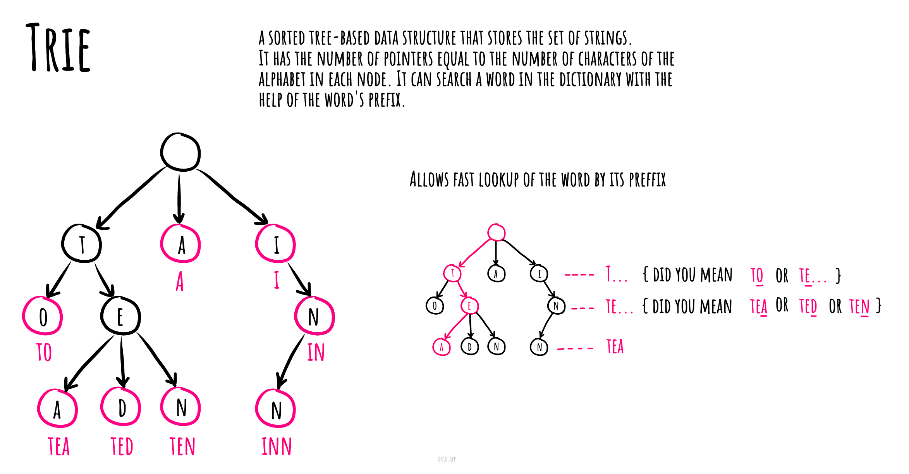

## 字典树

在计算机科学中, **字典树(trie,中文又被称为”单词查找树“或 ”键树“)**, 也称为数字树,有时候也被称为基数树或前缀树（因为它们可以通过前缀搜索）,它是一种搜索树--一种已排序的数据结构,通常用于存储动态集或键为字符串的关联数组。

与二叉搜索树不同, 树上没有节点存储与该节点关联的键; 相反,节点在树上的位置定义了与之关联的键。一个节点的全部后代节点都有一个与该节点关联的通用的字符串前缀, 与根节点关联的是空字符串。

值对于字典树中关联的节点来说,不是必需的,相反,值往往和相关的叶子相关,以及与一些键相关的内部节点相关。

<!-- more -->



## TrieNode

### constructor(character, isCompleteWord = false)初始化方法

```javascript
/**
 * 构造函数
 * @param {string} character - 字符参数
 * @param {boolean} isCompleteWord - 是否为完整单词
 */
constructor(character, isCompleteWord = false) {
  this.character = character; // 将传入的字符参数赋值给对象的character属性
  this.isCompleteWord = isCompleteWord; // 将传入的isCompleteWord参数赋值给对象的isCompleteWord属性
  this.children = new HashTable(); // 创建一个新的HashTable对象，并将其赋值给对象的children属性
}
```

### getChild(character) 方法

```javascript
/**
 * 获取子节点
 * @param {string} character - 子节点的字符
 * @return {TrieNode} - 子节点对象
 */
getChild(character) {
  // 使用character作为键从children映射中获取子节点
  return this.children.get(character);
}
```

### addChild(character, isCompleteWord = false) 方法

```javascript
/**
 * @param {string} character  // 参数：要添加的字符
 * @param {boolean} isCompleteWord  // 参数：是否是完整的单词
 * @return {TrieNode}  // 返回值：添加的子节点
 */
addChild(character, isCompleteWord = false) {
  // 如果当前节点的子节点集合中不存在该字符
  if (!this.children.has(character)) {
    // 创建新的子节点，并将其添加到子节点集合中
    this.children.set(character, new TrieNode(character, isCompleteWord));
  }

  // 获取子节点
  const childNode = this.children.get(character);

  // 在类似于将 "car" 添加到 "carpet" 之后的情况下，需要将 "r" 字符标记为完整的单词
  childNode.isCompleteWord = childNode.isCompleteWord || isCompleteWord;

  // 返回子节点
  return childNode;
}
```

### removeChild(character) 方法

```javascript
/**
 * @param {string} character
 * @return {TrieNode}
 */
removeChild(character) {
  // 通过给定的字符找到对应的子节点
  const childNode = this.getChild(character);

  // 只有当子节点存在、不是完整的单词、且没有子节点时，才删除子节点
  if (
    childNode
    && !childNode.isCompleteWord
    && !childNode.hasChildren()
  ) {
    // 从父节点的子节点集合中删除该子节点
    this.children.delete(character);
  }

  // 返回当前 TrieNode 实例
  return this;
}
```

### hasChild(character) 方法

```javascript
/**
 * @param {string} character
 * @return {boolean}
 */
hasChild(character) {
  return this.children.has(character);
}
```

### hasChildren() 方法

```javascript
/**
 * Check whether current TrieNode has children or not.
 * 检查当前 TrieNode 是否有子节点。
 * @return {boolean}
 * 返回一个布尔值，表示当前 TrieNode 是否有子节点。
 */
hasChildren() {
  // Get the keys of the children and check the length of the keys array.
  // 获取子节点的键，并检查键数组的长度。
  return this.children.getKeys().length !== 0;
}
```

### suggestChildren() 方法

```javascript
/**
 * @return {string[]}
 */
suggestChildren() {
  // 使用扩展运算符 (...) 创建一个新数组，其中包含从 children 对象获取的所有键
  return [...this.children.getKeys()];
}
```

### toString() 方法

```js
/**
 * 返回对象的字符串表示形式。
 * @return {string}
 */
toString() {
  // 获取子节点作为字符串的表示形式
  let childrenAsString = this.suggestChildren().toString();
  // 如果存在子节点，则在字符串末尾添加冒号
  childrenAsString = childrenAsString ? `:${childrenAsString}` : '';
  // 如果当前节点为完整单词，则在字符串末尾添加星号
  const isCompleteString = this.isCompleteWord ? '*' : '';

  // 返回由字符、完整标记和子节点字符串组成的字符串
  return `${this.character}${isCompleteString}${childrenAsString}`;
}
```

## Trie 类

### constructor() 初始化方法

```js
constructor() {
  // 创建一个新的TrieNode对象，并将其赋值给当前对象的head属性
  this.head = new TrieNode(HEAD_CHARACTER);
}
```

### addWord(word) 方法

```js
/**
 * 将单词添加到 Trie 中
 * @param {string} word - 要添加的单词
 * @return {Trie} - 返回 Trie 对象
 */
addWord(word) {
  // 将单词转为字符数组
  const characters = Array.from(word);
  // 初始化当前节点为 Trie 的根节点
  let currentNode = this.head;

  // 遍历单词的每个字符
  for (let charIndex = 0; charIndex < characters.length; charIndex += 1) {
    // 判断是否为单词的最后一个字符
    const isComplete = charIndex === characters.length - 1;
    // 将当前字符添加为当前节点的子节点，并更新当前节点为添加的子节点
    currentNode = currentNode.addChild(characters[charIndex], isComplete);
  }

  // 返回 Trie 对象
  return this;
}
```

### deleteWord(word) 方法

```js
/**
 * @param {string} word
 * @return {Trie}
 */
deleteWord(word) {
  // 定义深度优先删除函数，参数为当前节点和字符索引（默认为0）
  const depthFirstDelete = (currentNode, charIndex = 0) => {
    // 如果字符索引超出了单词的长度，说明要删除的字符超出了单词的范围，直接返回
    if (charIndex >= word.length) {
      return;
    }

    // 获取当前字符
    const character = word[charIndex];
    // 获取当前字符对应的下一个节点
    const nextNode = currentNode.getChild(character);

    // 如果下一个节点为空，说明要删除的单词没有被添加到Trie中，直接返回
    if (nextNode == null) {
      return;
    }

    // 递归调用深度优先删除函数，继续删除下一个字符
    depthFirstDelete(nextNode, charIndex + 1);

    // 如果当前字符是单词的最后一个字符，将下一个节点的isCompleteWord标记设为false
    if (charIndex === (word.length - 1)) {
      nextNode.isCompleteWord = false;
    }

    // 只有当下一个节点没有子节点且isCompleteWord为false时，才删除该子节点
    currentNode.removeChild(character);
  };

  // 从头节点开始进行深度优先删除
  depthFirstDelete(this.head);

  //返回Trie对象本身
  return this;
}
```

### suggestNextCharacters(word) 方法

```js
/**
 * @param {string} word
 * @return {string[]}
 */
suggestNextCharacters(word) {
  // 获取给定单词的最后一个字符节点
  const lastCharacter = this.getLastCharacterNode(word);

  // 如果最后一个字符节点不存在
  if (!lastCharacter) {
    // 返回null
    return null;
  }

  // 返回最后一个字符节点的建议下一个字符
  return lastCharacter.suggestChildren();
}
```

### doesWordExist(word) 方法

```js
/**
 * 检查 Trie 中是否存在完整的单词。
 *
 * @param {string} word - 要检查的单词
 * @return {boolean} - 如果单词存在，则返回 true，否则返回 false
 */
doesWordExist(word) {
  // 获取单词的最后一个字符节点
  const lastCharacter = this.getLastCharacterNode(word);

  // 如果最后一个字符存在且被标记为完整单词，则返回 true，否则返回 false
  return !!lastCharacter && lastCharacter.isCompleteWord;
}
```

### getLastCharacterNode(word) 方法

```js
/**
 * @param {string} word
 * @return {TrieNode}
 */
getLastCharacterNode(word) {
  const characters = Array.from(word); // 将字符串转换为字符数组
  let currentNode = this.head; // 初始化当前节点为头节点

  for (let charIndex = 0; charIndex < characters.length; charIndex += 1) { // 循环遍历字符数组
    if (!currentNode.hasChild(characters[charIndex])) { // 如果当前节点没有该字符的子节点
      return null; // 返回空
    }

    currentNode = currentNode.getChild(characters[charIndex]); // 更新当前节点为该字符的子节点
  }

  return currentNode; // 返回最后访问的节点
}
```
