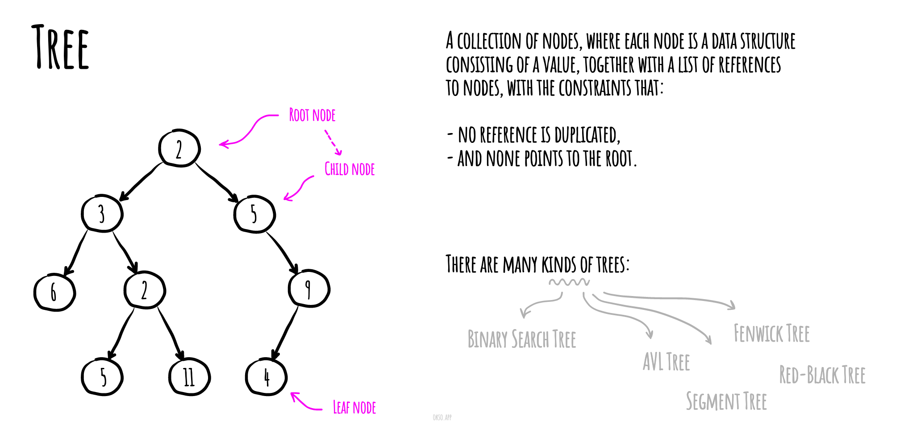

# 树

- [二叉搜索树](/2023/12/14/data-structures-011-BinarySearchTree)
- [AVL 树](avl-tree)
- [红黑树](red-black-tree)
- [线段树](segment-tree) - with min/max/sum range queries examples
- [芬威克树/Fenwick Tree](fenwick-tree) (Binary Indexed Tree)

在计算机科学中, **树(tree)** 是一种广泛使用的抽象数据类型(ADT)— 或实现此 ADT 的数据结构 — 模拟分层树结构, 具有根节点和有父节点的子树,表示为一组链接节点。

树可以被(本地地)递归定义为一个(始于一个根节点的)节点集, 每个节点都是一个包含了值的数据结构, 除了值,还有该节点的节点引用列表(子节点)一起。
树的节点之间没有引用重复的约束。

一棵简单的无序树; 在下图中:

标记为 7 的节点具有两个子节点, 标记为 2 和 6;
一个父节点,标记为 2,作为根节点, 在顶部,没有父节点。

<!-- more -->



## BinaryTreeNode

### constructor

```js
/**
 * @param {*} [value] - 节点的值.
 */
constructor(value = null) {
  // 初始化左子节点为null
  this.left = null;
  // 初始化右子节点为null
  this.right = null;
  // 初始化父节点为null
  this.parent = null;
  // 将传入的值赋给节点的值
  this.value = value;

  // 用于存储与节点相关的元信息的哈希表
  this.meta = new HashTable();

  // 用于比较二叉树节点的比较器
  this.nodeComparator = new Comparator();
}
```

### leftHeight

```js
/**
 * 这是一个 getter 方法，用于获取节点的左子树的高度
 * @return {number}
 */
get leftHeight() {
  // 如果左子树不存在，返回高度为 0
  if (!this.left) {
    return 0;
  }

  // 返回左子树的高度加上 1
  return this.left.height + 1;
}
```

### rightHeight

```js
/**
 * 这是一个 getter 方法，用于获取节点的右子树的高度
 * @return {number}
 */
get rightHeight() {
  // 如果没有右子节点，返回高度为0
  if (!this.right) {
    return 0;
  }

  // 返回右子节点的高度加1
  return this.right.height + 1;
}
```

### height

```js
/**
 * @return {number}
 */
get height() {
  // 返回左子树高度和右子树高度的最大值
  return Math.max(this.leftHeight, this.rightHeight);
}
```

### balanceFactor

```js
/**
 * @return {number}
 */
get balanceFactor() {
  // 返回左子树高度减去右子树高度的差值
  return this.leftHeight - this.rightHeight;
}
```

### uncle

```js
/**
 * 获取父节点的兄弟节点（如果存在）。
 * @return {BinaryTreeNode} 返回父节点的兄弟节点，如果不存在则返回undefined。
 */
get uncle() {
  // 检查当前节点是否有父节点。
  if (!this.parent) {
    return undefined;
  }

  // 检查当前节点是否有祖父节点。
  if (!this.parent.parent) {
    return undefined;
  }

  // 检查祖父节点是否有两个子节点。
  if (!this.parent.parent.left || !this.parent.parent.right) {
    return undefined;
  }

  // 现在我们知道当前节点有祖父节点，并且这个祖父节点有两个子节点。让我们找出谁是叔叔节点。
  if (this.nodeComparator.equal(this.parent, this.parent.parent.left)) {
    // 右侧的节点是叔叔节点。
    return this.parent.parent.right;
  }

  // 左侧的节点是叔叔节点。
  return this.parent.parent.left;
}
```

### setValue(value)

```js
/**
 * 设置节点的值
 * @param {*} value - 要设置的值
 * @return {BinaryTreeNode} - 返回当前节点
 */
setValue(value) {
  // 将当前节点的值设置为给定的值
  this.value = value;

  // 返回当前节点
  return this;
}
```

### setLeft(node)

```js
/**
 * 将一个新的节点设置为当前节点的左子节点
 * @param {BinaryTreeNode} node
 * @return {BinaryTreeNode}
 */
setLeft(node) {
  // 如果当前节点已经有一个左子节点，则将其父节点设置为null，即将其分离。
  if (this.left) {
    this.left.parent = null;
  }

  // 将新节点设置为当前节点的左子节点。
  this.left = node;

  // 将当前节点设置为新左子节点的父节点。
  if (this.left) {
    this.left.parent = this;
  }

  // 返回更新后的当前节点。
  return this;
}
```

### setRight(node)

```js
/**
 * 将一个新的节点设置为当前节点的右子节点
 * @param {BinaryTreeNode} node
 * @return {BinaryTreeNode}
 */
setRight(node) {
  // 重置右节点的父节点，因为右节点将被替换。
  if (this.right) {
    this.right.parent = null;
  }

  // 将新的节点附加到右节点。
  this.right = node;

  // 将当前节点设置为新右节点的父节点。
  if (node) {
    this.right.parent = this;
  }

  return this;
}
```

### removeChild(nodeToRemove)

```js
/**
 * 从当前节点的子树中移除指定的节点
 * @param {BinaryTreeNode} nodeToRemove
 * @return {boolean}
 */
removeChild(nodeToRemove) {
  // 检查当前节点的左子节点是否存在，并且是否与要移除的节点相等
  if (this.left && this.nodeComparator.equal(this.left, nodeToRemove)) {
    // 如果相等，将左子节点设置为null，表示移除该节点
    this.left = null;
    // 返回true，表示成功移除了节点
    return true;
  }

  // 检查当前节点的右子节点是否存在，并且是否与要移除的节点相等
  if (this.right && this.nodeComparator.equal(this.right, nodeToRemove)) {
    // 如果相等，将右子节点设置为null，表示移除该节点
    this.right = null;
    // 返回true，表示成功移除了节点
    return true;
  }

  // 如果左右子节点都不等于要移除的节点，则返回false，表示未成功移除节点
  return false;
}
```

### replaceChild(nodeToReplace, replacementNode)

```js
/**
 * 替换二叉树节点的子节点
 * @param {BinaryTreeNode} nodeToReplace 要替换的节点
 * @param {BinaryTreeNode} replacementNode 替换后的节点
 * @return {boolean} 返回替换结果的布尔值
 */
replaceChild(nodeToReplace, replacementNode) {
  // 检查要替换的节点和替换后的节点是否存在
  if (!nodeToReplace || !replacementNode) {
    return false;
  }

  // 如果当前节点存在左子节点，并且要替换的节点与左子节点相等
  if (this.left && this.nodeComparator.equal(this.left, nodeToReplace)) {
    // 将左子节点替换为新的节点
    this.left = replacementNode;
    return true;
  }

  // 如果当前节点存在右子节点，并且要替换的节点与右子节点相等
  if (this.right && this.nodeComparator.equal(this.right, nodeToReplace)) {
    // 将右子节点替换为新的节点
    this.right = replacementNode;
    return true;
  }

  // 如果没有进行替换操作，则返回false
  return false;
}
```

### traverseInOrder

```js
/**
 * 执行二叉树的中序遍历
 * @return {*[]}
 */
traverseInOrder() {
  // 创建一个空数组用于存储遍历结果
  let traverse = [];

  // 如果左子节点存在，则递归调用左子节点的traverseInOrder方法，并将结果追加到traverse数组中
  if (this.left) {
    traverse = traverse.concat(this.left.traverseInOrder());
  }

  // 将当前节点的值添加到traverse数组中，表示访问了当前节点
  traverse.push(this.value);

  // 如果右子节点存在，则递归调用右子节点的traverseInOrder方法，并将结果追加到traverse数组中
  if (this.right) {
    traverse = traverse.concat(this.right.traverseInOrder());
  }

  // 返回遍历结果数组
  return traverse;
}
```

### toString

```js
/** 返回对象的字符串表示
 * @return {string}
 */
toString() {
  return this.traverseInOrder().toString();
}
```
