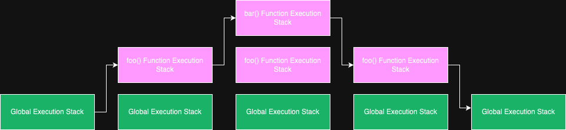

## Execution Context(执行上下文)

### 什么是执行上下文?

执行上下文是一个环境的抽象概念, 这个环境用于评估和执行`JavaScript`代码. 任何代码在`JavaScript`中运行时,都是在**执行上下文**中运行的.

#### 执行上下文的类型

在`JavaScript`中执行上下文有三种类型:

- `Global Execution Context`(全局执行上下文)
- `Function Execution Context`(函数执行上下文)
- `Eval Function Execution Context`(eval 函数执行上下文)

<!-- more -->

##### 全局执行上下文

这是默认的或者说基本的执行上下文. 不在任何函数内的代码, 属于在全局执行上下文中. 它执行两件事:

1. 创建一个全局对象, 在浏览器环境时是`window`对象.
2. 将这个全局对象赋值给`this`.

##### 函数执行上下文

每当一个函数被调用时, 会给这个函数创建一个新的执行上下文环境. 每个函数都有自己的执行上下文, 当函数被调用时创建. 可以有任意数量的函数执行上下文. 每当创建一个新的执行上下文时, 它都会按照已定义的顺序执行一系列步骤.

##### eval 函数执行上下文

在`eval`函数中执行的代码, 会有自己的执行上下文环境.

## Execution Stack(执行栈)

执行栈, 在其他编程语言中也叫'调用栈', 是一种 LIFO 栈结构(后进先出),用于在代码执行期间存储所有已创建的执行上下文.
当`JavaScript`引擎首次加载`script`脚本时, 会创建一个全局执行上下文, 并将其`push`到当前执行栈中.每当引擎发现有函数调用时, 会为该函数创建一个新的函数执行上下文, 并将其`push`到当前执行栈的栈顶.
引擎会执行执行上下文位于栈顶的函数.当这个函数执行完成时, 它的执行上下文会从当前执行栈中`pop`出来. 之前指向栈顶的指针会移到栈顶的下一个.

示例代码如下:

```js
const a = "hello";

function foo() {
  console.log("Inside foo function");
  bar();
  console.log("Again inside foo function");
}

function bar() {
  console.log("Inside bar function");
}

foo();
console.log("Inside Global Execution Context");
```

执行栈如图所示:


当上面的代码在浏览器上加载时, `JavaScript`引擎会创建一个全局执行上下文, 并将其`push`到当前的执行栈中. 当遇到调用`foo()`函数时, `JavaScript`引擎会给这个函数创建一个新的执行上下文, 并将其`push`到当前执行栈的栈顶.
然后引擎执行`foo()`函数, 在`foo`函数内部遇到调用`bar()`函数时, `JavaScript`引擎会给这个`bar`函数创建一个执行上下文, 并将其`push`到当前执行栈的栈顶. 当`bar()`函数执行完成后, 会执行当前执行栈的`pop`操作, 将栈顶的执行上下文`pop`出栈, 指向栈顶的指针下移, 指向`foo()`函数执行上下文.
当`foo()`函数执行完成后, 同样会执行当前执行栈的`pop`操作, 将栈顶的执行上下文`pop`出栈, `foo()`函数执行上下文会被移除掉, 同时指向栈顶的指针下移, 指向全局执行上下文. 当所有的代码都执行完后, `JavaScript`引擎会从当前执行栈中移出全局执行上下文.

## 执行上下文是如何创建的?

创建执行上下文的过程分两个阶段

1. `Creation Phase` (创建阶段)
2. `Execution Phase` (执行阶段)

### 创建阶段

执行上下文在创建阶段创建的. 在创建阶段会发生以下事情:

1. 创建 `LexicalEnvironment` (词法环境)组件
2. 创建 `VariableEnvironment` (变量环境)组件

因此, 执行上下文的概念上可以表示为:

```js
ExecutionContext = {
    LexicalEnvironment: <ref. to LexicalEnvironment in memory>,
    VariableEnvironment: <ref. to VariableEnvironment in memory>
}
```

#### LexicalEnvironment

[官方 ES6 的文档 LexicalEnvironment](https://262.ecma-international.org/6.0/#sec-lexical-environments)定义如下:

> A Lexical Environment is a specification type used to define the association of Identifiers to specific variables and functions based upon the lexical nesting structure of ECMAScript code. A Lexical Environment consists of an Environment Record and a possibly null reference to an outer Lexical Environment.
> 翻译: 词法环境是一种规范类型，用于根据 ECMAScript 代码的词法嵌套结构定义标识符与特定变量和函数的关联。词法环境由一个环境记录和一个可能为空的外部词法环境引用组成。

简单说, 词法环境是一个包含`identifier`-`variable`映射的结构(这里的`identifier`是指变量或函数的名称, `variable`是指实际对象[包括函数对象和数组对象]或原始值的引用)

例如, 考虑下面的代码片段:

```js
var a = 20;
var b = 40;

function foo() {
  console.log("bar");
}
```

它的词法环境结构像这样:

```js
lexicalEnvironment = {
    a: 20,
    b: 40,
    foo: <ref. to foo function>
}
```

词法环境由三部分组成:

1. `Environment Record`(环境记录)
2. `Reference to the outer environment` (外部环境的引用)
3. `This binding` (this 绑定)

##### Environment Record

环境记录是在词法环境中存储变量和函数声明的地方.
有两种类型的环境记录:

1. `Declarative environment record`(声明性环境记录) - 顾名思义, 是用于存储变量和函数声明. 函数代码的词法环境包含一个声明性环境记录.
2. `Object environment record`(对象环境记录) - 全局代码的词法环境包含一个对象环境记录. 除了变量和函数声明外, 对象环境记录还存储了一个全局绑定对象(在浏览器环境是`window`对象). 因此, 对于每个绑定对象的属性(在浏览器中, 它包含浏览器提供给`window`对象的属性和方法), 在记录中会创建一个新条目.

> 注意 ⚠️: 对于函数代码, 环境记录也包含一个`arguments`对象, 该对象包含`index`和传给函数的参数`arguments`之间的映射, 以及传递给函数参数的长度`length`.

例如, 以下函数代码的`arguments`对象如下所示:

```js
function foo(a, b) {
    var c = a + b;
}
foo(2, 3);

// argument object
Arguments: {0: 2, 1: 3, length: 2}
```

##### Reference to the Outer Environment

外部环境的引用是指可以访问它的外部词法环境. 意味着如果在当前词法环境中找不到变量, `JavaScript`引擎可以在外部环境中寻找这些变量.

##### This Binding

`this`绑定决定了`this`的值.
在全局执行上下文中, `this`的值指向全局对象(在浏览器环境, `this`指的是`Window`对象).
在函数执行上下文中, `this`的值依赖于函数是如何被调用的. 如果是被一个对象调用, 则`this`的值指向该对象, 否则, `this`的值指向全局对象或者`undefined`(在严格模式下). 例如:

```js
const person = {
  name: "kobe",
  birth: 1990,
  calcAge: function () {
    console.log(2023 - this.birth);
  },
};

person.calAge(); // `this`指向person对象, 因为`calAge`是被person对象调用.

const otherCalAge = person.calAge();
otherCalAge(); // `this`指向全局对象, 因为没有对象来调用它
```

词法环境伪代码如下:

```js
GlobalExecutionContext = {
    LexicalEnvironment: {
        EnvironmentRecord: {
            Type: "Object",
            // Identifier bindings go here
        },
        outer: <null>,
        this: <global object>
    }
}

FunctionExecutionContext = {
    LexicalEnvironment: {
        EnvironmentRecord: {
            Type: "Declarative",
            // Identifier bindings go here
        },
        outer: <Global or outer function environment reference>,
        this: <depends on how function is called>
    }
}
```

#### Variable Environment

它也是一个词法环境, 它的环境记录保存了在执行上下文中由`VariableStatements`创建的绑定.
如上所述, 变量环境也是一个词法环境, 因此它具有上述定义的词法环境的所有属性和组件.

在 ES6 中, `LexicalEnvironment`组件和`VariableEnvironment`组件之间的一个区别是, 前者用于存储函数声明和变量(`let`和`const`)绑定, 而后者仅用于存储变量(`var`)绑定.

### 执行阶段

在这个阶段, 对所有变量的赋值都完成了, 并且代码最终也执行完毕.

例如:

```js
let a = 20;
const b = 30;
var c;

function multiply(e, f) {
  var g = 20;
  return e * f * g;
}
c = multiply(20, 30);
```

当以上代码执行时,`JavaScript`引擎会创建一个全局执行上下文来执行全局代码. 全局执行上下文在创建阶段像这样:

```js
GlobalExecutionContext = {
    LexicalEnvironment: {
        EnvironmentRecord: {
            Type: "Object",
            // Identifier bindings go here
            a: < uninitialized >,
            b: < uninitialized >,
            multiply: < func >
        },
        outer: <null>,
        ThisBinding: <Global Object>
    },
    VariableEnvironment: {
        EnvironmentRecord: {
            Type: "Object",
            // Identifier bindings go here
            c: undefined,
        },
        outer: <null>,
        ThisBinding: <Global Object>
    }
}
```

在执行阶段, 变量赋值完成. 因此全局执行上下文在执行阶段像这样:

```js
GlobalExecutionContext = {
    LexicalEnvironment: {
        EnvironmentRecord: {
            Type: "Object",
            // Identifier bindings go here
            a: 20,
            b: 30,
            multiply: < func >
        },
        outer: <null>,
        ThisBinding: <Global Object>
    },
    VariableEnvironment: {
        EnvironmentRecord: {
            Type: "Object",
            // Identifier bindings go here
            c: undefined,
        },
        outer: <null>,
        ThisBinding: <Global Object>
    }
}
```

当遇到函数`multiply(20, 30)`调用时, 一个新的执行上下文被创建, 用来执行函数代码. 因此该函数执行上下文在创建阶段像这样:

```js
FunctionExecutionContext = {
    LexicalEnvironment: {
        EnvironmentRecord: {
            Type: "Declarative",
            // Identifier bindings go here
            Arguments: {0: 20, 1: 30, length: 2},
        },
        outer: <GlobalLexicalEnvironment>,
        ThisBinding: <Global Object or undefined>
    },
    VariableEnvironment: {
        EnvironmentRecord: {
            Type: "Declarative",
            // Identifier bindings go here
            g: undefined,
        },
        outer: <GlobalLexicalEnvironment>,
        ThisBinding: <Global Object or undefined>
    }
}
```

之后, 执行上下文经过执行阶段, 函数内部的变量赋值完成. 因此函数执行上下文在执行阶段像这样:

```js
FunctionExecutionContext = {
    LexicalEnvironment: {
        EnvironmentRecord: {
            Type: "Declarative",
            // Identifier bindings go here
            Arguments: {0: 20, 1: 30, length: 2},
        },
        outer: <GlobalLexicalEnvironment>,
        ThisBinding: <Global Object or undefined>
    },
    VariableEnvironment: {
        EnvironmentRecord: {
            Type: "Declarative",
            // Identifier bindings go here
            g: 20,
        },
        outer: <GlobalLexicalEnvironment>,
        ThisBinding: <Global Object or undefined>
    }
}
```

函数执行完成后, 函数返回值存储在变量`c`中. 因此全局词法环境会更新. 之后, 全局代码执行完毕, 整个程序结束.

> 注意 ⚠️: `let`和`const`定义的变量在创建阶段没有任何与它们关联的值, 但`var`定义的变量会被设置为`undefined`.

这是因为在创建阶段, 代码被扫描以查找变量和函数的声明, 函数声明被完整地存储在环境中, 而`var`变量会被初始化设置为`undefined`, `let`和`const`变量保持未初始化状态.

这就是为什么在声明 var 变量之前访问 var 定义的变量,结果是`undefined`. 而在声明`const`或`let`变量之前访问其定义的变量, 会报`reference`错.

也就是`hoisting`(变量提升).

> 注意 ⚠️: 在执行阶段, 如果`JavaScript`引擎在源代码中`let`变量声明的地方没有找到其值, 会将`undefined`值赋给它.
