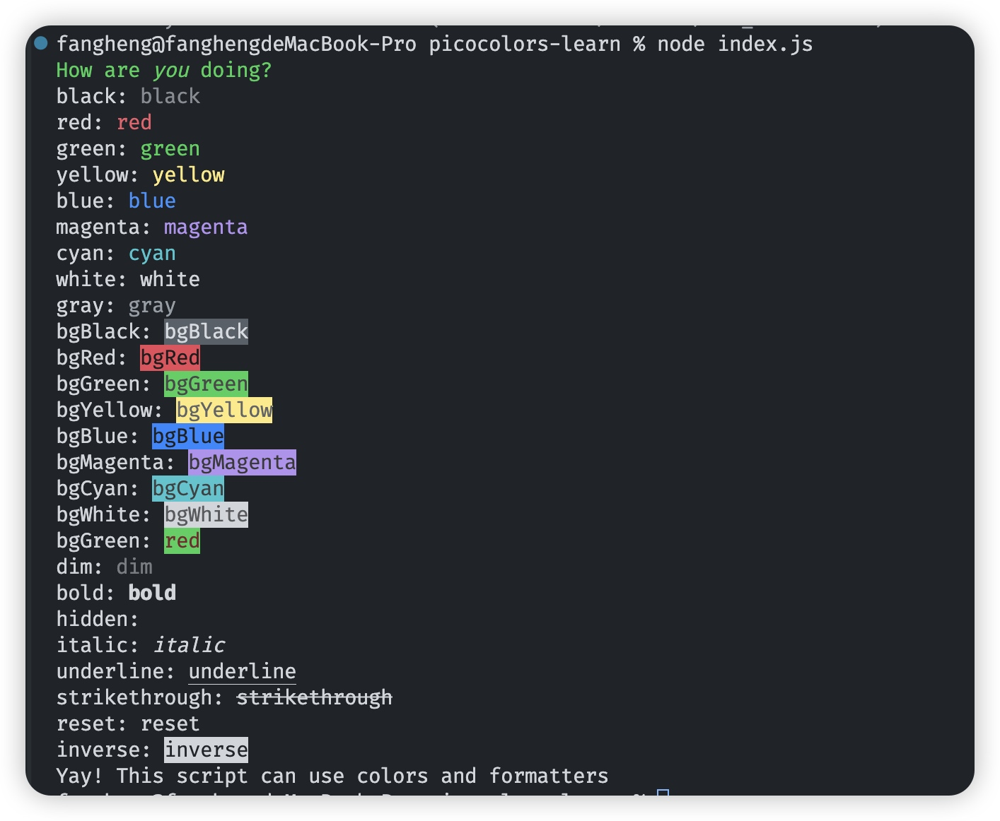

# Picocolors

> [github 地址](https://github.com/alexeyraspopov/picocolors)

## 作用

使用[ANSI](https://en.wikipedia.org/wiki/ANSI_escape_code#Colors)颜色进行终端输出格式化的最小和最快的库。

```js
import pc from "picocolors";

console.log(pc.green(`How are ${pc.italic(`you`)} doing?`));
```

**特性：**

- 无依赖
- 比`chalk`库的体积小 14 倍，速度快 2 倍
- 被像`PostCSS`、`SVGO`、`Stylelint`,和`Browserslist`这些流行工具使用
- Node.js v6+ 和浏览器支持。支持 CJS 和 ESM 项目。
- 包括 TypeScript 类型声明
- `NO_COLOR` 友好

<!-- more -->

## 使用

`Picocolors` 提供了一个对象，其中包括各种文本着色和格式化功能

```js
import pc from "picocolors";
```

该对象包括以下着色方法：`black`,`red`,`green`,`yellow`,`blue`,`magenta`,`cyan`,`white`,`gray`.

```js
console.log(`I see a ${pc.red("red door")} and I want it painted ${pc.black("black")}`);
```

该对象也包括以下背景色修改方法:`bgBlack`,`bgRed`,`bgGreen`,`bgYellow`,`bgBlue`,`bgMagenta`,`bgCyan`,`bgWhite`.

```js
console.log(pc.bgBlack(pc.white(`Tom appeared on the sidewalk with a bucket of whitewash and a long-handled brush.`)));
```

除了颜色，该对象还包括以下格式化方法：`dim`,`bold`,`hidden`,`italic`,`underline`,`strikethrough`,`reset`,`inverse`.

```js
for (let task of tasks) {
  console.log(`${pc.bold(task.name)} ${pc.dim(task.durationMs + "ms")}`);
}
```

该库还提供了一些额外的工具来确保任务的最佳结果：

- `isColorSupported`: 布尔值，明确地告诉屏幕上是否支持出现颜色或格式

  ```js
  import pc from "picocolors";

  if (pc.isColorSupported) {
    console.log("Yay! This script can use colors and formatters");
  }
  ```

- `createColors(enabled)`: 一个函数，返回一个带有手动定义的颜色支持配置的新的 API 对象

  ```js
  import pc from "picocolors";

  let { red, bgWhite } = pc.createColors(options.enableColors);
  ```

## 测试代码

```js
import pc from "picocolors";

console.log(pc.green(`How are ${pc.italic(`you`)} doing?`));

// test colors

console.log(`black: ${pc.black("black")}`);
console.log(`red: ${pc.red("red")}`);
console.log(`green: ${pc.green("green")}`);
console.log(`yellow: ${pc.yellow("yellow")}`);
console.log(`blue: ${pc.blue("blue")}`);
console.log(`magenta: ${pc.magenta("magenta")}`);
console.log(`cyan: ${pc.cyan("cyan")}`);
console.log(`white: ${pc.white("white")}`);
console.log(`gray: ${pc.gray("gray")}`);

// test bg colors

console.log(`bgBlack: ${pc.bgBlack("bgBlack")}`);
console.log(`bgRed: ${pc.bgRed("bgRed")}`);
console.log(`bgGreen: ${pc.bgGreen("bgGreen")}`);
console.log(`bgYellow: ${pc.bgYellow("bgYellow")}`);
console.log(`bgBlue: ${pc.bgBlue("bgBlue")}`);
console.log(`bgMagenta: ${pc.bgMagenta("bgMagenta")}`);
console.log(`bgCyan: ${pc.bgCyan("bgCyan")}`);
console.log(`bgWhite: ${pc.bgWhite("bgWhite")}`);

console.log(`bgGreen: ${pc.bgGreen(pc.red("red"))}`);

// formatters

console.log(`dim: ${pc.dim("dim")}`);
console.log(`bold: ${pc.bold("bold")}`);
console.log(`hidden: ${pc.hidden("hidden")}`);
console.log(`italic: ${pc.italic("italic")}`);
console.log(`underline: ${pc.underline("underline")}`);
console.log(`strikethrough: ${pc.strikethrough("strikethrough")}`);
console.log(`reset: ${pc.reset("reset")}`);
console.log(`inverse: ${pc.inverse("inverse")}`);

// utils

if (pc.isColorSupported) {
  console.log(`Yay! This script can use colors and formatters`);
}
```

结果截图:


